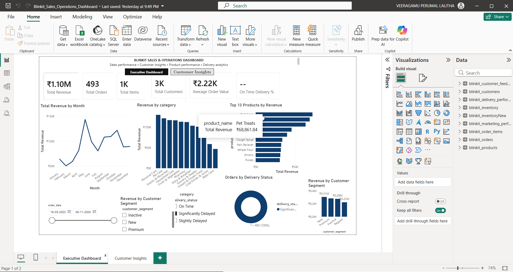
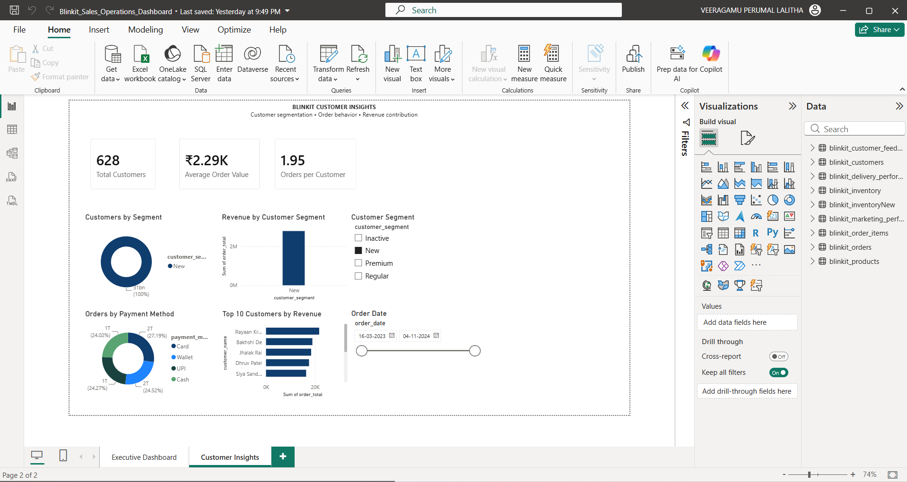

# Blinkit Sales & Operations Dashboard | Power BI

An interactive Power BI dashboard designed to analyze Blinkit's sales performance, customer segments, product performance, and delivery operations.

## Project Overview

This project transforms Blinkit sales and operational data into an interactive business intelligence dashboard.

The dashboard provides a consolidated view of:

- Sales performance
- Order and item metrics
- Customer segments
- Product revenue performance
- Delivery status
- Monthly revenue trends
- Category-wise revenue

## Tools & Technologies

- Power BI
- DAX
- Power Query
- Data Modeling
- Data Visualization
- GitHub

## Key KPIs

The dashboard tracks important business metrics including:

- Total Revenue
- Total Orders
- Total Items
- Total Customers
- Average Order Value
- On-Time Delivery %

## Dashboard Features

### Executive Dashboard

The executive dashboard provides a high-level overview of business performance.

Key visuals include:

- Revenue by Month
- Revenue by Category
- Top 10 Products by Revenue
- Revenue by Customer Segment
- Orders by Delivery Status
- Interactive Date Filter
- Customer Segment Slicer
- Delivery Status Slicer

### Customer Insights

The customer analysis page helps understand customer segments and their contribution to revenue.

### Interactive Navigation

A Power BI page navigator allows users to move between:

- Executive Dashboard
- Customer Insights

## Key Insights

The dashboard helps answer business questions such as:

1. How is revenue changing over time?
2. Which product categories generate the most revenue?
3. Which products are the top revenue contributors?
4. Which customer segments contribute the most revenue?
5. What percentage of orders are delivered on time?
6. How are orders distributed across delivery statuses?

## Data Analysis

DAX measures were created to calculate key business metrics such as:

- Total Revenue
- Total Orders
- Total Items
- Total Customers
- Average Order Value
- On-Time Delivery %

Interactive slicers and filters allow users to dynamically analyze the dashboard.

## Dashboard Preview

### Executive Dashboard



### Customer Insights



## Project Structure

```text
blinkit-sales-operations-powerbi/
│
├── Blinkit_Sales_Operations_Dashboard.pbix
│
├── Screenshots/
│   ├── executive-dashboard.png
│   └── customer-insights.png
│
└── README.md
## Business Value

This dashboard demonstrates how raw sales and operational data can be transformed into actionable business insights using Power BI.

It can support decision-making related to:

- Sales performance
- Product strategy
- Customer segmentation
- Delivery operations
- Revenue optimization

## Author

**Veeragamu Perumal Lalitha**

GitHub: https://github.com/vplalithalali99
